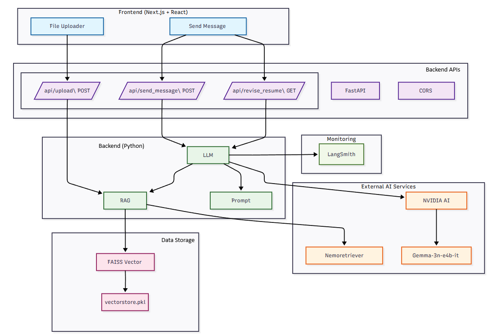
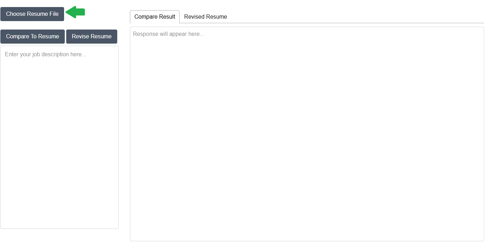
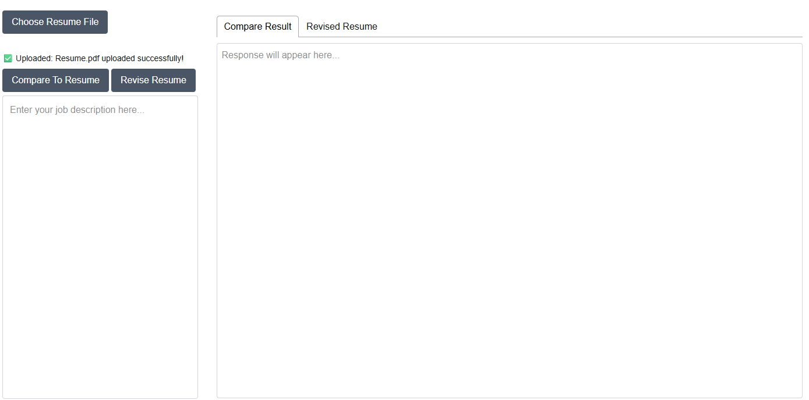
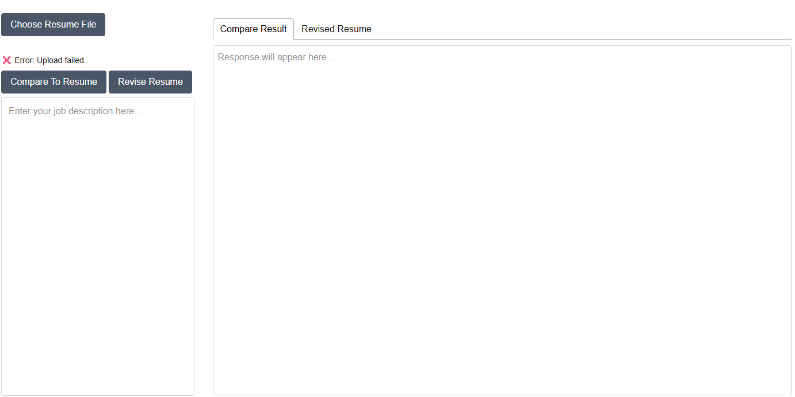
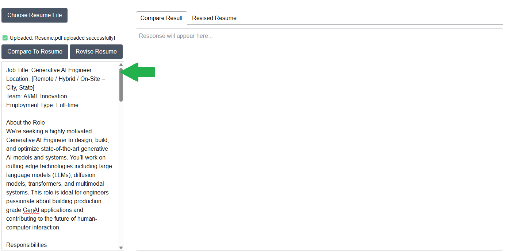
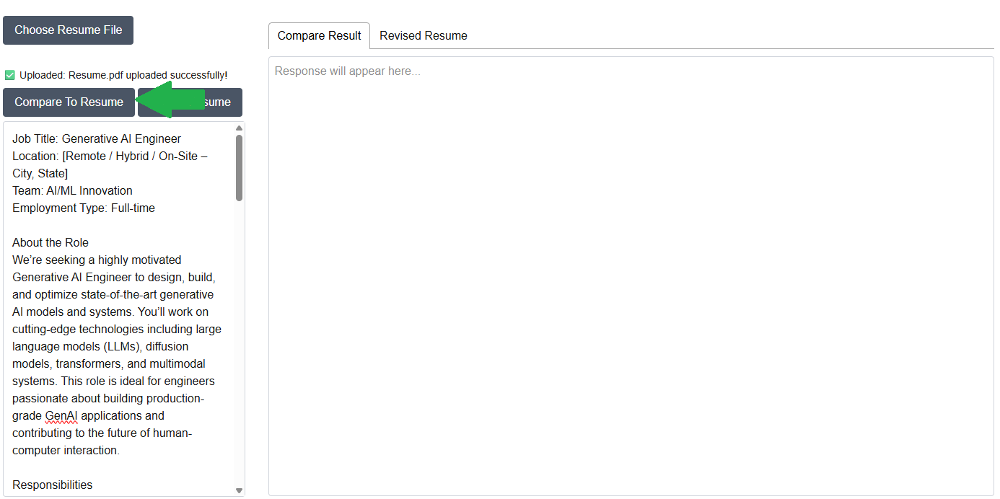
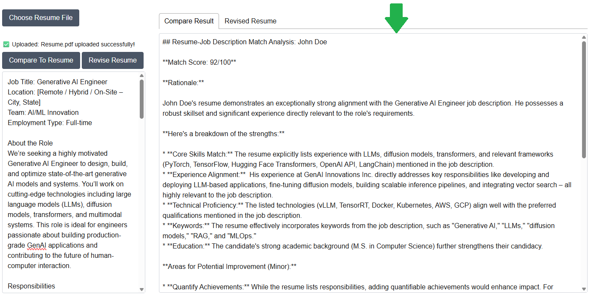
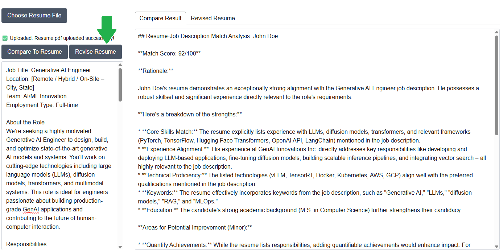
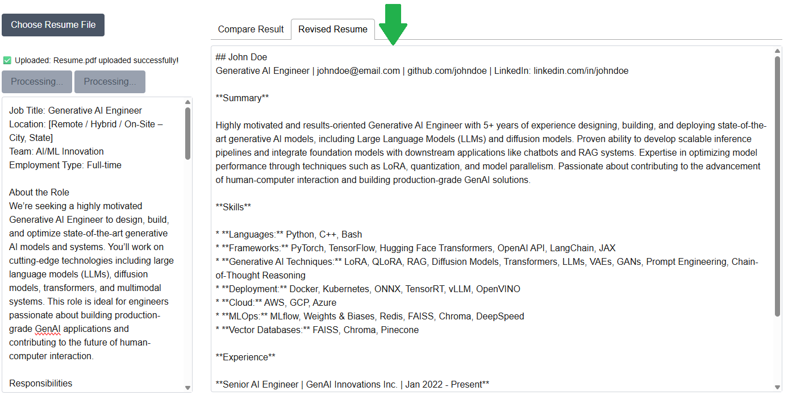

# AI Resume Match and curation

A faster way to see compare your resume against your next opportunity! If you're like me an tired of spending hours comparing your credentials against job postings this tool is for you. All you need is a resume (the more details the better) and a job description. The AI will automatically compare your new opportunity against your credentials and give you a score! If the job matches the AI will also help your curate your resume to help you stand out more.


## System Architecture



### Prerequisites

- Docker CE or Docker Desktop (for Windows)
- Nvidia AI API key
- LangSmith API key

## Quickstart Instructions

1. Insatll Docker engine of your choice

    For linux distibutions you can follow the appropraite steps on [Docker Engine install steps](https://docs.docker.com/engine/install/).

    For Windows and macOS I recommend installing [Docker Desktop](https://docs.docker.com/desktop/setup/install/windows-install/)


1. Get Nvidia API key

    Follow the [NVIDIA API key generation steps](https://docs.nvidia.com/nim/large-language-models/latest/getting-started.html#generate-an-api-key)

1. Get LangSmith API Key

    Follow the [LangsSmith API key generation steps](https://docs.smith.langchain.com/administration/how_to_guides/organization_management/create_account_api_key)

1. setup /server/.env
    ```
    NVIDIA_API_KEY=<YOUR_KEY>
    LANGSMITH_API_KEY=<YOUR_KEY>
    LANGSMITH_ENDPOINT=https://api.smith.langchain.com
    LANGSMITH_TRACING=true
    LANGSMITH_PROJECT=<PROJECT_NAME>
    ```

1. Build the client and server containers
    ```bash
    make build
    ```

1. Run the client and server containers
    ```bash
    make run
    ```

1. Stop the client and server containers
    ```bash
    make down
    ```

## How To Use

### Choose Resume File

1. Select 'Choose Resume File' and upload your resume PDF from your local system

    

1. Check status message to verify success

    

1. Here is an example of a failed upload

    

### Compare to Resume

1. Copy job description text into the textbox

    

1. Select the 'Compare To Resume' button to start the comparison

    

1. Results will be displayed in the 'Compare Result' textbox tab

    

### Revise Resume

1. After comparison is finished you may select 'Revise Resume' to begin generating a new resume curated for the job description

    

1. Once complete the revised resume will display in the 'Revised Resume' textbox tab

    

## Frameworks Used

### Models Used
- **google/gemma-3n-e4b-it**: Primary model for comparing job description with the resume and providing the revised resume.
- **nvidia/llama-3.2-nemoretriever-1b-vlm-embed-v1**: Retreival model for resume vector embeddings

### Frontend Frameworks
- **React**: JavaScript library for building user interfaces
- **Next.js**: React framework for production applications
- **TypeScript**: Typed superset of JavaScript

### Backend Frameworks
- **Flask**: Python web framework for building APIs
- **FastAPI**: Modern Python web framework for building APIs

### AI/ML Frameworks
- **LangChain**: Framework for developing applications with LLMs
- **FAISS**: Library for efficient similarity search and clustering
- **OpenAI**: API for accessing GPT models
- **NVIDIA AI Endpoints**: Platform for deploying AI models

### Styling & UI Frameworks
- **Tailwind CSS**: Utility-first CSS framework
- **React Tabs**: Tab component library for React

### Development & Build Tools
- **Node.js**: JavaScript runtime environment
- **npm**: Package manager for Node.js
- **Docker**: Containerization platform

### Database & Storage
- **FAISS**: Vector database for similarity search
- **File System**: Local file storage for uploads
- **PyPDF**: PDF parsing library

### API & Integration
- **REST API**: HTTP-based API architecture
- **Server-Sent Events (SSE)**: Real-time data streaming
- **CORS**: Cross-Origin Resource Sharing
