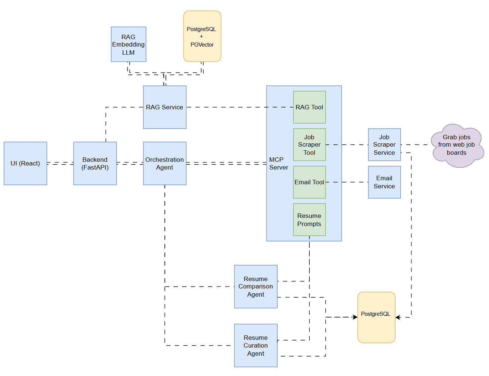

# AI Resume Match and curation

Tired of manually comparing your resume to job postings? The Resume Agent offers a faster, smarter way to evaluate how well your credentials align with your next opportunity. Simply upload your resume (the more detailed, the better) along with your dream job description. My AI Agent will analyze and compare them, providing a compatibility score. If there's a strong match, the tool will also help you refine your resume to highlight your strengths and stand out to recruiters.

## System Architecture



[Orchestration Agent](docs/resume-agent.md)

### Prerequisites

- Docker CE or Docker Desktop (for Windows)
- Nvidia AI API key
- LangSmith API key

## Quickstart Instructions

1. Insatll Docker engine of your choice

    For linux distibutions you can follow the appropraite steps on [Docker Engine install steps](https://docs.docker.com/engine/install/).

    For Windows and macOS I recommend installing [Docker Desktop](https://docs.docker.com/desktop/setup/install/windows-install/)

    > **_NOTE:_** If you are on Windows I would recommend [installing WSL 2 with Ubuntu](https://documentation.ubuntu.com/wsl/latest/howto/install-ubuntu-wsl2/). If not you can install [Make](https://gnuwin32.sourceforge.net/packages/make.htm) and run through cmd or PowerShell.


1. Get Nvidia API key

    Follow the [NVIDIA API key generation steps](https://docs.nvidia.com/nim/large-language-models/latest/getting-started.html#generate-an-api-key)

1. Get LangSmith API Key

    Follow the [LangsSmith API key generation steps](https://docs.smith.langchain.com/administration/how_to_guides/organization_management/create_account_api_key)

1. Create /server/.env by copying or renaming /server/template.env
    ```
    NVIDIA_API_KEY=<YOUR_KEY>
    LANGSMITH_API_KEY=<YOUR_KEY>
    LANGSMITH_ENDPOINT=https://api.smith.langchain.com
    LANGSMITH_TRACING=true
    LANGSMITH_PROJECT=<PROJECT_NAME>
    ```

1. Build the client and server containers
    ```bash
    make build
    ```

1. Run the client and server containers
    ```bash
    make run
    ```

## To Stop the client and server containers Run:
    ```bash
    make down
    ```

## Frameworks & Tools Used

### Models & Embeddings
- **google/gemma-3n-e4b-it**: Primary LLM for job-resume comparison and resume revision.
- **nvidia/llama-3.2-nemoretriever-1b-vlm-embed-v1**: Embedding model for resume vectorization and retrieval.
- **Ollama**: Local LLM serving and inference.
- **OpenAI GPT**: (Optional) For additional LLM tasks.

### Frontend Frameworks & Libraries
- **React**: UI library for building interactive interfaces.
- **Next.js**: React framework for SSR and production builds.
- **TypeScript**: Strongly-typed JavaScript for safer code.
- **Tailwind CSS**: Utility-first CSS framework for styling.
- **React Tabs**: Tab component library for React.

### Backend Frameworks & Libraries
- **FastAPI**: Modern, async Python web framework for APIs.
- **Flask**: (Legacy/auxiliary) Python web framework.
- **LangChain**: Framework for LLM orchestration, tool use, and agent workflows.
- **LangGraph**: State machine framework for orchestrating multi-step LLM workflows.
- **LangSmith**: Tracing and observability for LLM applications.
- **PGVector**: PostgreSQL extension for vector similarity search.
- **psycopg2-binary**: PostgreSQL database adapter for Python.
- **PyPDF**: PDF parsing and extraction.
- **sseclient**: Server-Sent Events client for real-time streaming.

### Orchestration & Agent Infrastructure
- **MultiServerMCPClient**: Multi-agent orchestration and tool integration.
- **Langchain MCP Adapters**: For agent-to-agent and tool communication.
- **Job Scraper Service**: Custom tool for scraping job boards (Indeed, LinkedIn).
- **Resume Curation Agent**: Automated resume enhancement pipeline.
- **Resume Comparison Agent**: Automated job-resume scoring.
- **NVIDIA AI Endpoints**: Platform for deploying AI models

### Database & Storage
- **PostgreSQL**: Relational database for job, resume, and embedding storage.
- **PGVector**: Vector extension for similarity search.
- **File System**: Local storage for uploads and intermediate files.

### Development & Build Tools
- **Node.js**: JavaScript runtime for frontend tooling.
- **npm**: Node.js package manager.
- **Docker**: Containerization for consistent development and deployment.

### API & Integration
- **REST API**: HTTP-based API endpoints.
- **Server-Sent Events (SSE)**: Real-time data streaming to UI.
- **CORS**: Cross-Origin Resource Sharing for API access.

### Other Libraries & Utilities
- **torch, torchvision, torchaudio**: PyTorch ecosystem for model inference.
- **docling**: Document processing utilities.

> **Note:** FAISS is no longer used for vector search; PGVector with PostgreSQL is now the primary vector database.
