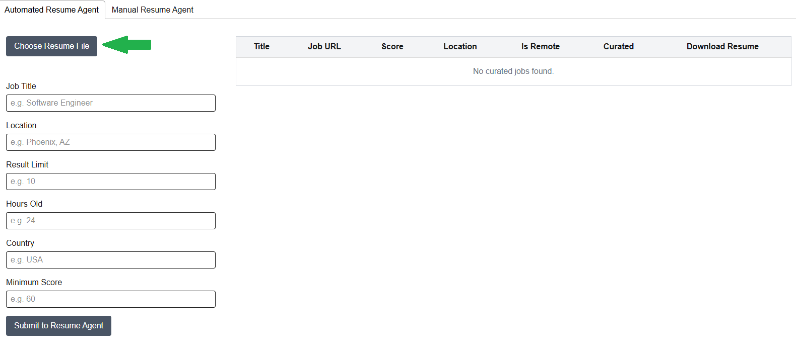
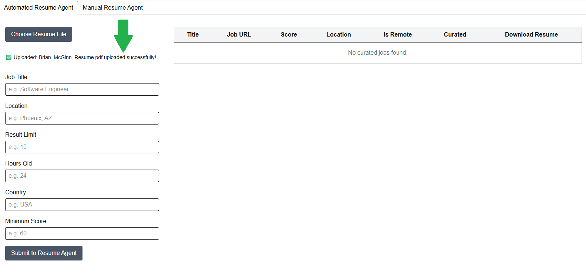

# AI Resume Match and Curation

Tired of manually comparing your resume to job postings? The Resume Agent offers a faster, smarter way to evaluate how well your credentials align with your next opportunity. Simply upload your resume (the more detailed, the better) along with your dream job description. My AI Agent will analyze and compare them, providing a compatibility score. If there's a strong match, the tool will also help you refine your resume to highlight your strengths and stand out to recruiters.

## System Architecture


> **_Learn more about the_** [Orchestration Agent](docs/resume-agent.md)

### Prerequisites

- Docker CE or Docker Desktop (for Windows)
- NVIDIA AI API key
- LangSmith API key

## Quickstart Instructions

1. Install the Docker engine of your choice

    For Linux distributions, you can follow the appropriate steps on the [Docker Engine install steps](https://docs.docker.com/engine/install/).

    For Windows and macOS, I recommend installing [Docker Desktop](https://docs.docker.com/desktop/setup/install/windows-install/).

    > **_NOTE:_** If you are on Windows, I recommend [installing WSL 2 with Ubuntu](https://documentation.ubuntu.com/wsl/latest/howto/install-ubuntu-wsl2/).

1. Get NVIDIA API key

    Follow the [NVIDIA API key generation steps](https://docs.nvidia.com/nim/large-language-models/latest/getting-started.html#generate-an-api-key).

1. Get LangSmith API key

    Follow the [LangSmith API key generation steps](https://docs.smith.langchain.com/administration/how_to_guides/organization_management/create_account_api_key).

1. Create `/server/.env` by copying or renaming `/server/template.env`:
    ```
    NVIDIA_API_KEY=<YOUR_KEY>
    LANGSMITH_API_KEY=<YOUR_KEY>
    LANGSMITH_ENDPOINT=https://api.smith.langchain.com
    LANGSMITH_TRACING=true
    LANGSMITH_PROJECT=<PROJECT_NAME>
    ```

1. Build and Run the client and server containers:

    ```bash
    docker compose up
    ```

    > **_NOTE:_** If you need to rebuild an individual container you can run or rebuild all containers

    ```bash
    docker compose build <service name>
    or
    docker-compose up --build --force-recreate
    ```

1. Upload your resume

    Select 'Choose Resume File' and upload your resume PDF from your local system.

    

    Once complete, you will see an upload successful message.

    

1. Execute the Resume Agent:

    Once the containers have successfully started, you can open http://127.0.0.1:3000/. 
    
    By default, you will be taken to the `Automated Resume Agent` page. Here, you can adjust the parameters or use the defaults to run the agent flow.

    

    ## Parameters

    **Job Title**: The job title you wish to search for on job boards. You may use a broad term such as "Software Engineer" or a more specific title like "Staff Generative AI Backend Software Engineer." Please note that results may vary significantly based on the specificity of the job title.

    **Location**: The preferred location for your job search. You may specify a city, state, or use terms like `remote` or `United States` for broader or remote searches.

    **Result Limit**: The maximum number of job postings you would like the agent to process.

    > **_NOTE:_** Processing may take several minutes, depending on the result limit and the complexity of the resume comparison. The Submit button will indicate when the agent is running, and the results table will be populated upon completion.

    **Hours Old**: The maximum age of job postings to include, in hours. For example, entering 24 will only retrieve jobs posted within the past day.

    **Country**: The country in which you would like to search for jobs.

    **Minimum Score**: The minimum job-resume match score you are willing to accept.

1. To stop the client and server containers, run:

    ```bash
    docker compose down
    ```


> **_IMPORTANT:_**  If you would like to continue to use the manual resume agent the instructions have moved to [Manual Agent](./docs/manual-agent.md).

## Frameworks & Tools Used

### Models & Embeddings
- **nvidia/llama-3.3-nemotron-super-49b-v1**: Primary LLM for job-resume comparison, resume revision, and orchestration.
- **nvidia/llama-3.2-nemoretriever-1b-vlm-embed-v1**: Embedding model for resume vectorization and retrieval.
- **NVIDIA AI Endpoints**: Platform for deploying and serving AI models.

### Frontend Frameworks & Libraries
- **React**: UI library for building interactive interfaces.
- **Next.js**: React framework for SSR and production builds.
- **TypeScript**: Strongly-typed JavaScript for safer code.
- **Tailwind CSS**: Utility-first CSS framework for styling.
- **React Tabs**: Tab component library for React.

### Backend Frameworks & Libraries
- **FastAPI**: Modern, async Python web framework for APIs.
- **LangChain**: Framework for LLM orchestration, tool use, and agent workflows.
- **LangGraph**: State machine framework for orchestrating multi-step LLM workflows.
- **LangSmith**: Tracing and observability for LLM applications.
- **PGVector**: PostgreSQL extension for vector similarity search.
- **psycopg2-binary**: PostgreSQL database adapter for Python.
- **docling**: Document processing utilities for PDF parsing and extraction.
- **weasyprint**: HTML to PDF conversion for resume generation.
- **markdown**: Markdown processing for text formatting.

### Orchestration & Agent Infrastructure
- **Model Context Protocol (MCP)**: Multi-agent orchestration and tool integration.
- **LangChain MCP Adapters**: For agent-to-agent and tool communication.
- **Job Scraper Service**: Custom tool for scraping job boards (Indeed) using python-jobspy.
- **Resume Curation Agent**: Automated resume enhancement pipeline.
- **Resume Comparison Agent**: Automated job-resume scoring.
- **Orchestrator Agent**: Multi-step workflow orchestration using LangGraph.

### Database & Storage
- **PostgreSQL**: Relational database for job, resume, and embedding storage.
- **PGVector**: Vector extension for similarity search.
- **File System**: Local storage for uploads and intermediate files.

### Development & Build Tools
- **Node.js**: JavaScript runtime for frontend tooling.
- **npm**: Node.js package manager.
- **Docker**: Containerization for consistent development and deployment.
- **Portainer**: Docker container management interface.
- **ESLint 9**: Code linting with Next.js and TypeScript configurations.
- **PostCSS**: CSS processing with Tailwind CSS integration.

### API & Integration
- **REST API**: HTTP-based API endpoints.
- **Server-Sent Events (SSE)**: Real-time data streaming to the UI.
- **CORS**: Cross-Origin Resource Sharing for API access.
- **FastMCP**: HTTP-based MCP server implementation.

### Other Libraries & Utilities
- **pandas**: Data manipulation and analysis for job processing.
- **python-jobspy**: Job scraping from Indeed and other job boards.
- **unstructured**: Document processing and text extraction.
