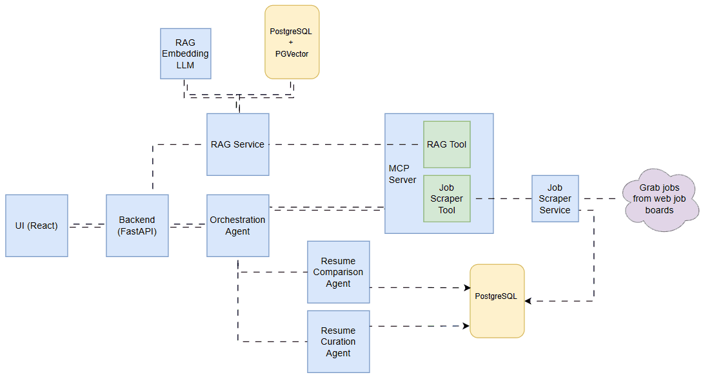

# AI Resume Match and curation

Tired of manually comparing your resume to job postings? The Resume Agent offers a faster, smarter way to evaluate how well your credentials align with your next opportunity. Simply upload your resume (the more detailed, the better) along with your dream job description. My AI Agent will analyze and compare them, providing a compatibility score. If there's a strong match, the tool will also help you refine your resume to highlight your strengths and stand out to recruiters.

## System Architecture



[Orchestration Agent](docs/resume-agent.md)

### Prerequisites

- Docker CE or Docker Desktop (for Windows)
- Nvidia AI API key
- LangSmith API key

## Quickstart Instructions

1. Insatll Docker engine of your choice

    For linux distibutions you can follow the appropraite steps on [Docker Engine install steps](https://docs.docker.com/engine/install/).

    For Windows and macOS I recommend installing [Docker Desktop](https://docs.docker.com/desktop/setup/install/windows-install/)

    > **_NOTE:_** If you are on Windows I would recommend [installing WSL 2 with Ubuntu](https://documentation.ubuntu.com/wsl/latest/howto/install-ubuntu-wsl2/). If not you can install [Make](https://gnuwin32.sourceforge.net/packages/make.htm) and run through cmd or PowerShell.


1. Get Nvidia API key

    Follow the [NVIDIA API key generation steps](https://docs.nvidia.com/nim/large-language-models/latest/getting-started.html#generate-an-api-key)

1. Get LangSmith API Key

    Follow the [LangsSmith API key generation steps](https://docs.smith.langchain.com/administration/how_to_guides/organization_management/create_account_api_key)

1. Create /server/.env by copying or renaming /server/template.env
    ```
    NVIDIA_API_KEY=<YOUR_KEY>
    LANGSMITH_API_KEY=<YOUR_KEY>
    LANGSMITH_ENDPOINT=https://api.smith.langchain.com
    LANGSMITH_TRACING=true
    LANGSMITH_PROJECT=<PROJECT_NAME>
    ```

1. Build the client and server containers
    ```bash
    make build
    ```

1. Run the client and server containers
    ```bash
    make run
    ```

## To Stop the client and server containers Run:
    ```bash
    make down
    ```

## Frameworks Used

### Models Used
- **google/gemma-3n-e4b-it**: Primary model for comparing job description with the resume and providing the revised resume.
- **nvidia/llama-3.2-nemoretriever-1b-vlm-embed-v1**: Retreival model for resume vector embeddings

### Frontend Frameworks
- **React**: JavaScript library for building user interfaces
- **Next.js**: React framework for production applications
- **TypeScript**: Typed superset of JavaScript

### Backend Frameworks
- **Flask**: Python web framework for building APIs
- **FastAPI**: Modern Python web framework for building APIs

### AI/ML Frameworks
- **LangChain**: Framework for developing applications with LLMs
- **FAISS**: Library for efficient similarity search and clustering
- **OpenAI**: API for accessing GPT models
- **NVIDIA AI Endpoints**: Platform for deploying AI models

### Styling & UI Frameworks
- **Tailwind CSS**: Utility-first CSS framework
- **React Tabs**: Tab component library for React

### Development & Build Tools
- **Node.js**: JavaScript runtime environment
- **npm**: Package manager for Node.js
- **Docker**: Containerization platform

### Database & Storage
- **FAISS**: Vector database for similarity search
- **File System**: Local file storage for uploads
- **PyPDF**: PDF parsing library

### API & Integration
- **REST API**: HTTP-based API architecture
- **Server-Sent Events (SSE)**: Real-time data streaming
- **CORS**: Cross-Origin Resource Sharing


# pip install stuff
pip install pandas
pip install python-jobspy
pip install openai==0.28
pip install openai-agents
pip install langgraph langchain
pip install from langchain_community.llms import Ollama
pip install langchain_community
pip install langgraph-prebuilt
pip install sseclient
pip install docling
pip install torch torchvision torchaudio --index-url https://download.pytorch.org/whl/nightly/cu128
uv install -U xformers --index-url https://download.pytorch.org/whl/cu128
pip install --upgrade langchain pgvector psycopg2-binary

docker compose build fast-server

docker exec -it pgvector-db /bin/bash
psql -U vector_admin -d resume_agent
SELECT title,score,curated FROM jobs;
SELECT title,score,recommendations FROM jobs;
SELECT title,curated_resume FROM jobs LIMIT 1;
\dx
\d+ resume_embeddings
\d+ langchain_pg_embedding
SELECT * FROM langchain_pg_embedding LIMIT 5;
SELECT COUNT(*) FROM langchain_pg_embedding;

DELETE FROM langchain_pg_embedding;
DELETE FROM jobs;

changes:
✅Utilize postgres for job storage
✅store job info in the postgres table.
✅return job title and some info but keep the description in the DB. It's too big for the prompt and causes issues.
✅Move job compare to graph as a node
✅Move job compare loop to the agent logic
✅save scores and comparison details to postgres table
✅sCreate curation agent
✅suse postgres table to get job desc, score, and comparision details
✅srag for resume
✅ssend resume, job desc, comparision details to llm to generate new resume
✅create feedback loop to do initial compare, review and fix errors, review tone to match job description, format for ats, cross validate with original resume to avoid hallucinations.
✅save new resume to table, save raw markdown format a
✅Add fully automated resume agent UI page
save in pdf format
orchestrator can extract new resume markdown and pdf to put on UI
UI will list job title, score, link, markdown download, and pdf download
