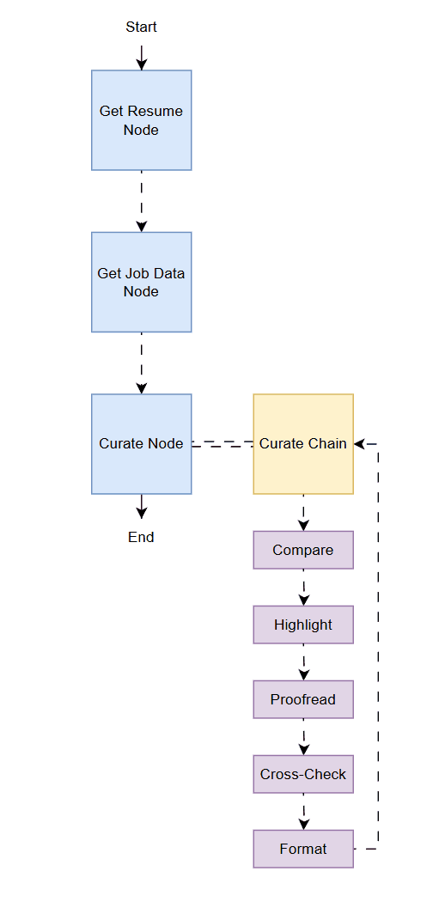

# Curation Agent

## Overview

The Curation Agent is responsible for orchestrating the automated refinement of resumes to better align with specific job descriptions. It leverages a multi-step pipeline built using LangChain and LangGraph, integrating retrieval-augmented generation (RAG), PostgreSQL (with PGVector), and large language models (LLMs) to iteratively enhance and format resumes for optimal job matching.

## Architecture Overview

The curation process is implemented as a stateful graph with the following primary nodes:

### 1. Get Resume Node

- **Functionality:** Retrieves the latest version of the candidate's resume from the vector store using the RAG service.
- **Implementation Details:** The RAG service currently fetches the entire resume document from the PostgreSQL PGVector database. Future enhancements will support storing and retrieving multiple or versioned documents.
- **Logging:** The system logs retrieval actions for traceability.

### 2. Get Job Data Node

- **Functionality:** Fetches a list of uncurated job postings from the PostgreSQL database. These jobs are typically generated by the job scraper component of the MCP Service.
- **Implementation Details:** Only jobs that have not yet been curated are selected, and a minimum job score threshold can be applied to filter relevant positions.
- **Logging:** The system logs the retrieval of job data for monitoring and debugging.

### 3. Curate Node

- **Functionality:** Iteratively refines the resume for each uncurated job using a sequence of LLM-driven steps and predefined prompts.
- **Implementation Details:** For each job, the agent:
    - Retrieves the job description and any previous recommendations.
    - Executes a multi-step curation pipeline using LangChain and custom prompts.
    - Updates the curated resume in the database and maintains a record of curated resumes for each job.

#### Curation Steps

The curation process consists of the following sequential steps, each powered by a dedicated prompt and LLM call:

1. **Compare:**  
   Compares the candidate's resume with the job description and previous recommendations. Identifies areas for improvement to better match the job requirements.

2. **Highlight:**  
   Extracts and prioritizes key words and phrases from the job description, ensuring these are emphasized in the revised resume.

3. **Proofread:**  
   Reviews the updated resume for grammatical, contextual, and factual accuracy, correcting any errors.

4. **Cross-Check:**  
   Validates the refined resume against the original to ensure that no critical information is lost and to minimize hallucinations or inaccuracies.

5. **Format:**  
   Formats the final version of the resume in Markdown for improved readability and ease of conversion to other formats (e.g., PDF).

- **Error Handling:**  
  The agent includes robust exception handling and logging to facilitate debugging and ensure reliability.

## Extensibility

- The architecture is designed for modularity, allowing for the addition of new curation steps or integration with other services.
- Future iterations will support document versioning and more granular resume retrieval.
