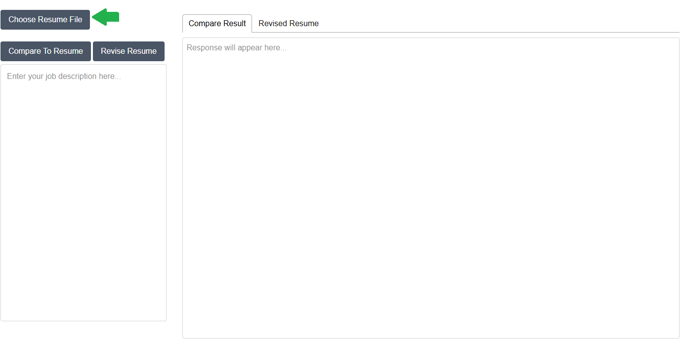
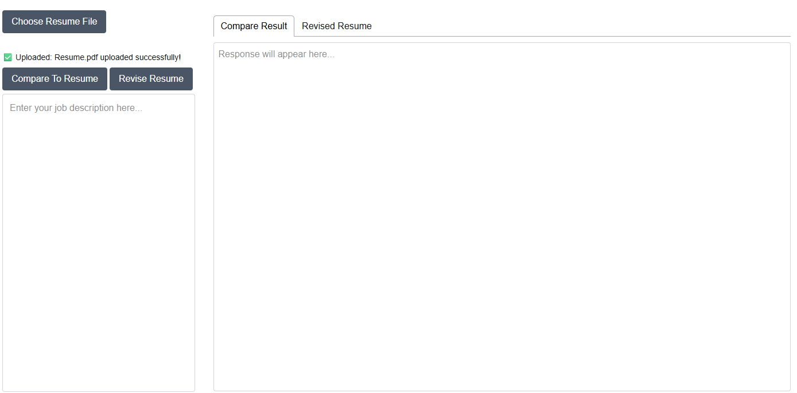
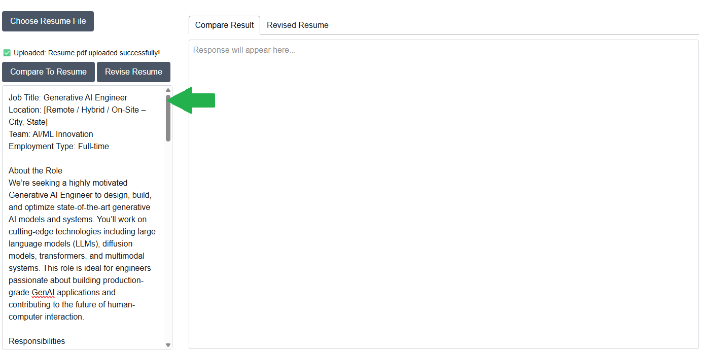
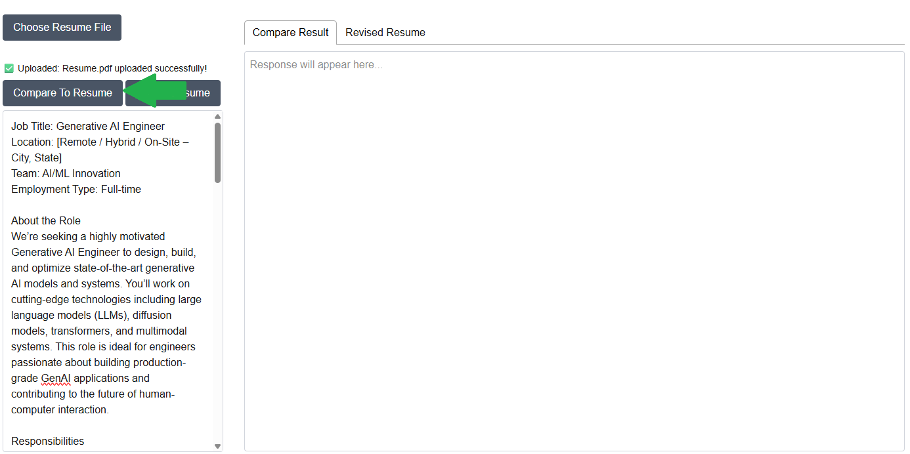
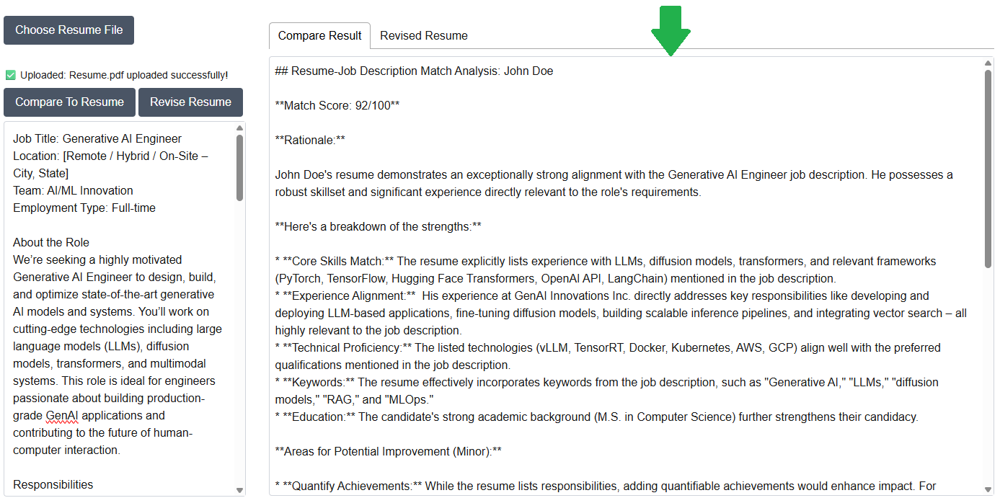
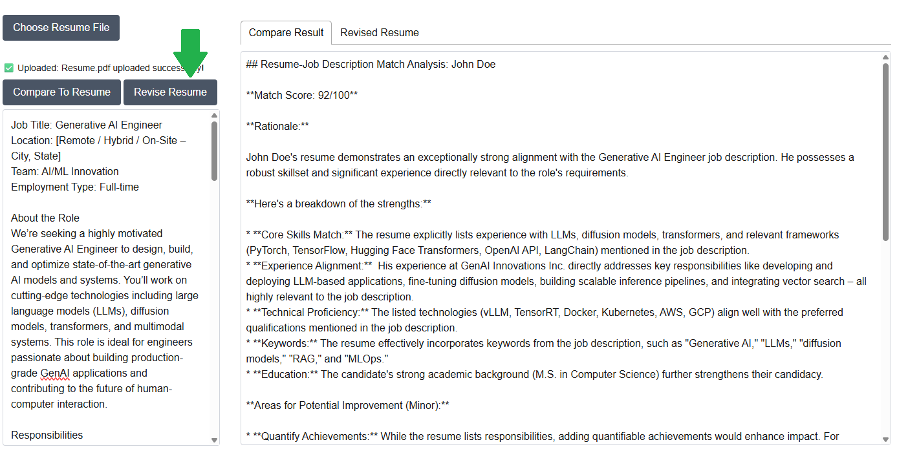
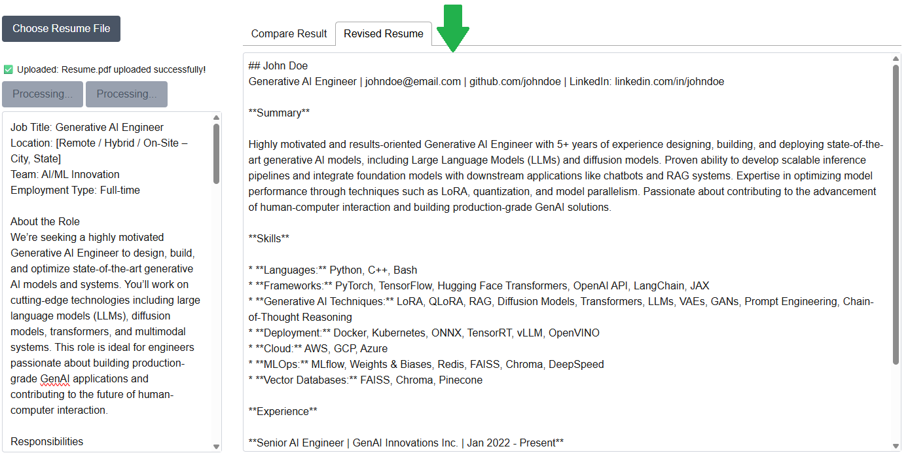

# Manually running the agent (legacy)

## How To Use

### Run Resume Agent

```bash
docker compose up
```

### Open Resume Agent

1. Go to [Resume Agent](http://127.0.0.1:3000/)

### Choose Resume File

1. Select 'Choose Resume File' and upload your resume PDF from your local system 

    
    > **_NOTE:_** Only PDF files are currently supported

1. Check status message to verify success

    

1. Here is an example of a failed upload

    

### Compare to Resume

1. Copy job description text into the textbox

    

1. Select the 'Compare To Resume' button to start the comparison

    

1. Results will be displayed in the 'Compare Result' textbox tab

    

### Revise Resume

1. After comparison is finished you may select 'Revise Resume' to begin generating a new resume curated for the job description

    

1. Once complete the revised resume will display in the 'Revised Resume' textbox tab

    