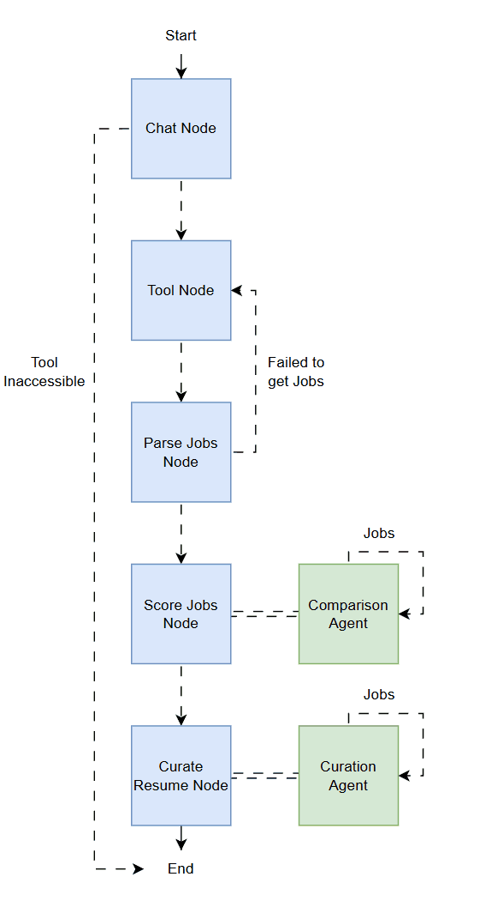

# Orchestration Agent

## Overview

The Orchestration Agent is responsible for managing the end-to-end workflow of automated job matching and resume curation. Built on a LangGraph-based state machine, it coordinates the flow between specialized nodes, integrating with both internal agents and external services such as the MCP server. This agent ensures that each step in the pipeline—from job retrieval to resume enhancement—is executed in the correct sequence.

## Architecture Overview

The orchestration process is implemented as a state graph, with each node representing a distinct step in the workflow. The main components are as follows:

### Chat Node

The Chat Node initializes the conversation with a language model (LLM) that is integrated with the MCP server. This node uses a system prompt, retrieved dynamically from the MCP server, and allows the LLM to access external tools via the MCP client. The chat node is responsible for handling user messages and orchestrating tool calls as needed.

### Tool Node

The Tool Node interacts with the MCP server to invoke the job scraper tool. This tool retrieves job postings relevant to the user's profile. If the tool node fails to connect to the MCP server or encounters an error, the orchestration process is terminated gracefully, ensuring robust error handling.

### Parse Job Node

The Parse Job Node processes the job data returned by the MCP job scraper. It parses the tool output in JSON format and attaches the resulting job list to the graph state for downstream processing. If the job list is empty or parsing fails, the node can trigger a retry of the tool node to attempt fetching jobs again.

### Score Jobs Node

Once a valid list of jobs is available, the Score Jobs Node invokes the Comparison Agent to evaluate and score each job against the user's resume. The agent generates a set of job scores, which are sorted and stored in the graph state for subsequent steps. This scoring process ensures that only the most relevant jobs are considered for resume curation.

### Curate Resume Node

The Curate Resume Node calls the Curation Agent to generate a tailored resume for the top-matching jobs. The curation process leverages LLMs and prompt templates to revise and optimize the resume according to the requirements of each job description. For further details, refer to the [Resume Curation Agent](./curation-agent.md) documentation.

### Jobs Table Return

Upon completion of the orchestration graph, the final list of jobs—along with their scores and curated resumes—is retrieved from the PostgreSQL database. This data is then returned to the UI, where it is displayed in the jobs table for user review and download.

## Extensibility

- The architecture is designed for modularity, allowing for the addition of new curation steps or integration with other services.
