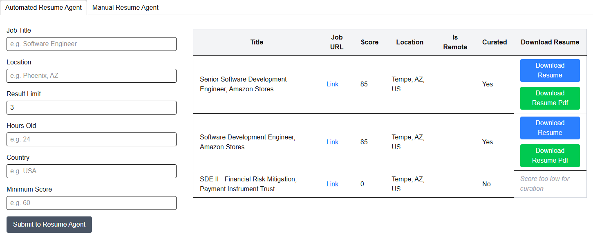

# Resume Agent

## System Architecture

## Components

### User Interface (React)

    The user interface is developed in React and provides an intuitive platform for users to configure job search parameters and review curated job recommendations. The UI facilitates resume uploads, job selection, and displays the results of the automated curation process.

### Backend API (FastAPI)

    The backend is implemented using FastAPI, exposing RESTful endpoints that enable seamless interaction between the UI, orchestration agents, and large language models (LLMs). The API manages requests related to resume uploads, job retrieval, and curation workflows.

### Orchestration Agent

    The Orchestration Agent is responsible for managing the end-to-end workflow of automated job matching and resume curation. Built on a LangGraph-based state machine, it coordinates the flow between specialized nodes, integrating with both internal agents and external services such as the MCP server. This agent ensures that each step in the pipeline—from job retrieval to resume enhancement—is executed in the correct sequence.

    For more details, see [Orchestration Agent](./orchestration-agent.md).

### RAG Service

    The Retrieval-Augmented Generation (RAG) Service leverages an LLM to segment resumes into logical sections, rather than fixed-size chunks. This approach enables more meaningful comparisons, such as evaluating current skills against job requirements. The RAG Service is the primary entry point for uploading and processing resumes.

#### RAG Embedding LLM

    The RAG Service utilizes the `nvidia/llama-3.2-nemoretriever-1b-vlm-embed-v1` embedding model to generate vector representations of resume sections, facilitating efficient storage and retrieval.

#### PostgreSQL + PGVector

    Resume embeddings are stored in a PostgreSQL database enhanced with the PGVector extension. This setup enables high-performance vector similarity searches, which are essential for matching resumes to job descriptions and for downstream curation tasks.

### Model Context Protocol (MCP) Server

    Server to host helpful tools, resources, and prompts for the agents to use. The job scraper tool for example provides a traditional web scrapping technique to ensure consistent results. The common prompts allow for sharing system and human prompts between agents.

#### RAG Tool

    Allows agents to access and load resume data from the RAG Service.

#### Job Scraper Tool

    Implements robust web scraping techniques to retrieve up-to-date job postings from online job boards such as Indeed and LinkedIn. The tool ensures consistent and reliable job data for the curation pipeline.

### Resume Comparison Agent

    This agent analyzes the list of jobs retrieved by the Job Scraper Tool and evaluates each job against the uploaded resume. It generates a job score for each position, quantifying the degree of match and prioritizing opportunities for the user.

### Resume Curation Agent

    The Curation Agent is responsible for orchestrating the automated refinement of resumes to better align with specific job descriptions. It leverages a multi-step pipeline built using LangChain and LangGraph, integrating retrieval-augmented generation (RAG), PostgreSQL (with PGVector), and large language models (LLMs) to iteratively enhance and format resumes for optimal job matching.

    For a detailed breakdown of the curation process, refer to [Resume Curation Agent](./curation-agent.md).

#### PostgreSQL

    A dedicated PostgreSQL server is used to store job information, including job descriptions, recommendations, and curated resumes. This approach ensures scalability and efficient handling of large text fields required for the curation workflow.
